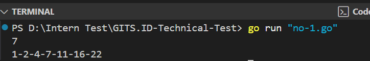
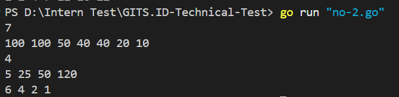
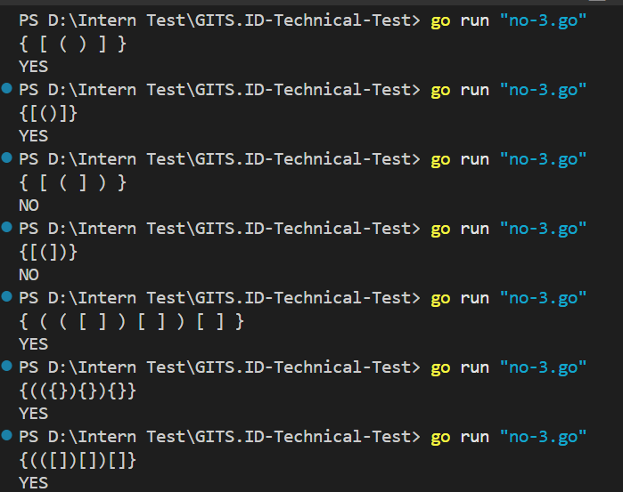

# GITS.ID-Technical-Test
Erdianti Wiga Putri Andini

### Complexity Explanation for Number 3
- **Waktu**: O(n), dimana n adalah panjang string input, dia melakukan iterasi untuk setiap karakter dalam string sebanyak satu kali.

- **Ruang**: O(n), karena worst case nya stack dapat menyimpan hingga n.

### Screenshot Output
- Nomor 1

- Nomor 2

- Nomor 3

